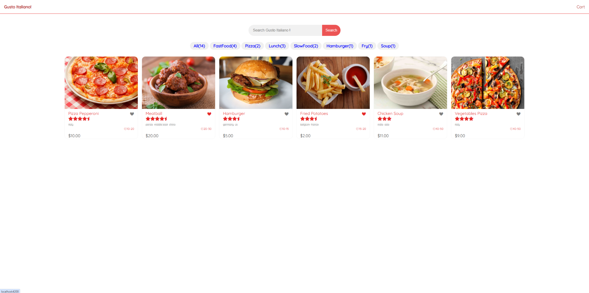
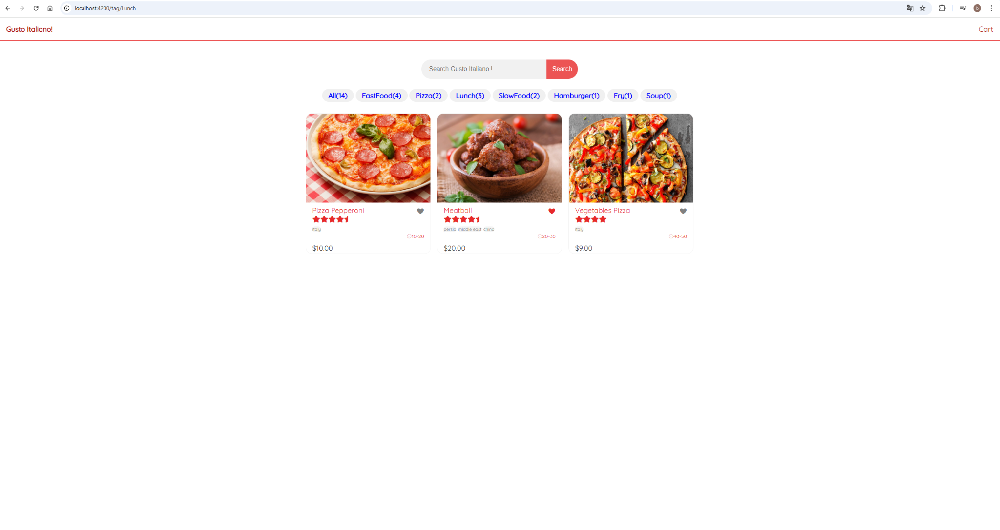
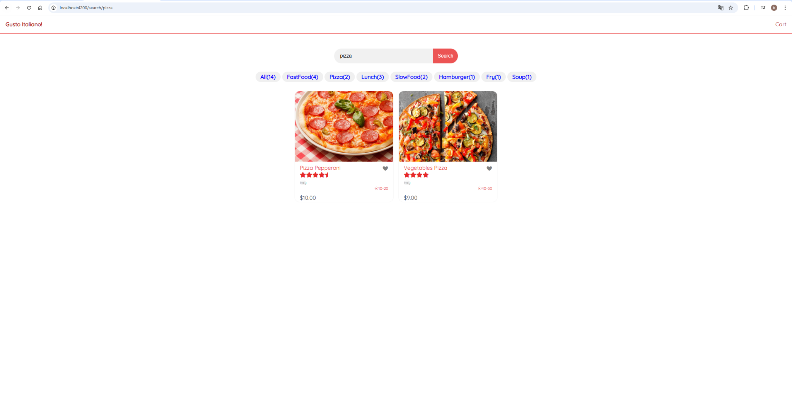
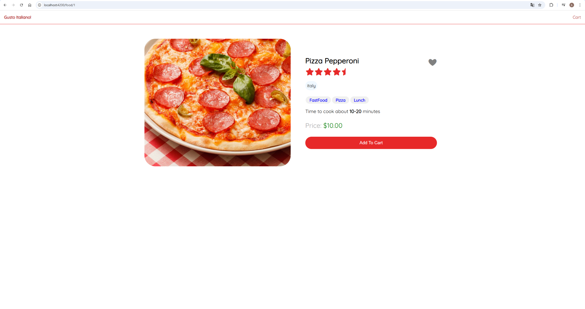
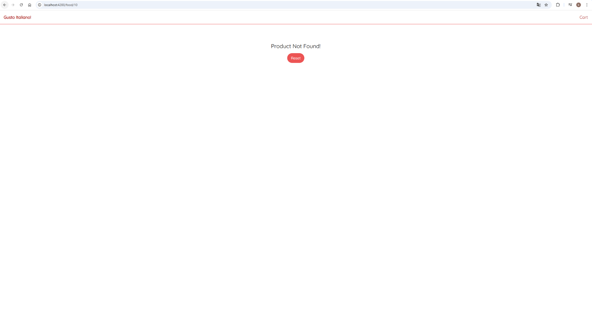
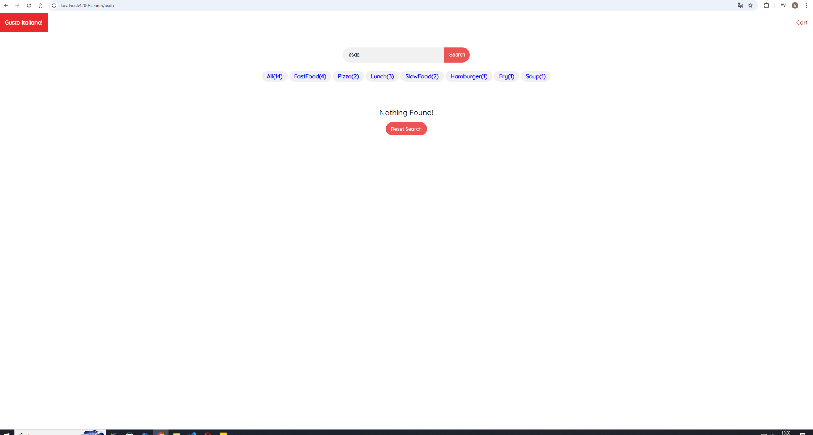

# 🍕 Gusto Italiano - Angular E-Commerce Project

## 📌 Table of Contents

- [📸 Screenshots](#-screenshots)
- [⚙️ Prerequisites](#prerequisites)
- [🚀 Features](#-features)
- [🎨 User Interface (UI)](#-user-interface-ui)
- [🚀 Installation and Setup](#-installation-and-setup)

---

## 📸 Screenshots

  
_Home Page_

  
_Filtered View_

  
_Input Search Page_

  
_Product Detail Page_

  
_Shopping Cart Page_

  
_Not Found (Invalid Product ID)_

  
_Not Found (Search)_

---

## ⚙️ Prerequisites

To run this project, you need to have the following installed:

- **[Node.js](https://nodejs.org/)**
- **[Angular CLI](https://angular.io/cli)** (Install it using `npm install -g @angular/cli`)

---

## 🚀 Features

- ✅ **Home Page** → Displays all products with filtering options by category.
- 🔍 **Search Functionality** → Allows users to search products by name.
- 🏷 **Filtering** → Users can filter products based on specific categories.
- 🛒 **Product Details** → Displays product information, price, and an "Add to Cart" button.
- ➕ **Cart Operations** → Allows users to add, remove, and update product quantities in the cart.
- 🚫 **404 Pages** → Redirects users when an invalid product ID or search query is entered.

---

## 🎨 User Interface (UI)

This project **does not use Bootstrap, Tailwind, or any UI libraries**.  
**All styles are custom-built using CSS from scratch.**

> **Style Files:**
>
> - `src/styles.scss` → Global styles
> - `src/app/**/*.scss` → Component-specific styles

---

## 🚀 Installation and Setup

### 1️⃣ **Clone the Repository**

```bash
git clone https://github.com/Emirkcgl/angular-food-app-.git
cd gusto-italiano
```
